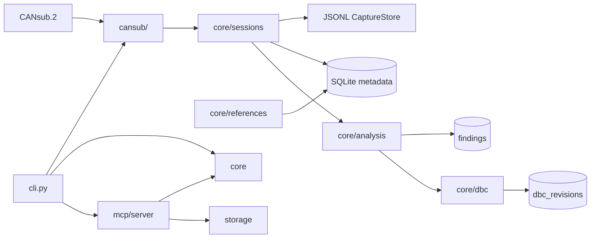

# can-research architecture

## Module boundaries

```text
canresearch/
├── cansub/     Hardware and CSS Electronics CANsub.2 API access only
├── core/       Protocol logic, references, DBC, sessions, analysis
├── mcp/        AI-facing tool interface (MCP server)
└── storage/    SQLite persistence for metadata and catalogues
```

### `cansub/` — hardware only

- Direct REST and WebSocket access to CANsub.2 (configured hostname or IP)
- Read-only channel status and live RX streaming
- Capture orchestration (`run_capture`) — no J1939 parsing, no DBC logic
- No SQLite access from this layer

### `core/` — domain logic

- **j1939** — 29-bit identifier parsing (no SAE reference data)
- **references** — local PGN/SPN/DDI catalogue populated from user imports
- **dbc** — DBC import/export and machine-specific generation
- **sessions** — session metadata; `JsonlCaptureStore` for raw frames
- **analysis** — correlation and findings over sessions

Raw capture frames stay **outside** SQLite. Session rows hold metadata and a
`frame_store_path` pointing to `data/sessions/<id>/frames.jsonl`.

### `mcp/` — AI client interface

- Exposes tools for session listing, reference lookup, analysis, and DBC operations
- Thin wrapper over `core/` and `storage/` — no direct hardware access
- Stdio transport in V1 (desktop MCP clients); SSE/HTTP reserved for later

### `storage/` — persistence

- SQLite for reference PGNs/SPNs, machines, sessions, observed PGNs, findings, DBC revisions
- **assets** — persistent device metadata (`asset_key`, type, manufacturer, model, …)
- **session_assets** — many-to-many link between sessions and assets with an explicit role
- Schema versioning via numbered migrations in `database.py`
- Default path: `data/references/canresearch.db` (gitignored)

## External / licensed data

| Data | Location | In repo? |
|------|----------|----------|
| SAE J1939 PDF / database | User-owned, external | **No** |
| ISO 11783 / ISOBUS snapshots | User-owned, external | **No** |
| Imported DBC reference files | `references/private/` or user path | **No** |
| Parsed reference SQLite rows | `data/references/canresearch.db` | **No** |
| Capture frame JSONL | `data/sessions/` | **No** |
| Example fixtures | `examples/` | **Yes** (non-licensed samples only) |

Copyrighted standards content must not be parsed, stored, or reproduced in this repository without appropriate licence.

## Verified data flow (desk unit)

```text
CANsub.2 (USB hostname or Ethernet)
  -> REST control/status (device info, channel status)
  -> WebSocket RX (wss://.../api/can/{channel}/ws)
  -> JsonlCaptureStore (data/sessions/<id>/frames.jsonl)
  -> SQLite session metadata
  -> offline session analyze (core/analysis)
  -> observed_pgns aggregates + reference catalogue lookup
```

## Classification flow (implemented)

```text
saved session (frames.jsonl)
  -> J1939 identifier parser (core/j1939)
  -> PGN / source address / destination address
  -> aggregate by PGN + SA (+ DA for PDU1)
  -> local reference catalogue lookup
  -> classification: j1939_base_2001 / j1939_addition / isobus_addition / unknown
```

## SPN decode flow (implemented)

```text
saved session (frames.jsonl)
  -> known j1939_base_2001 / j1939_addition PGN only
  -> reference PGN-SPN mappings + SPN scaling metadata
  -> bit extraction (core/spn_bits) + scaling (core/spn_scaling)
  -> engineering values (on demand via session decode)
```

Unknown/proprietary PGNs and ISOBUS DDI interpretation are skipped. Transport
protocol reassembly is not implemented.

## Asset identity model (implemented)

A single capture session may contain traffic from multiple physical assets (tractor,
implement, controller/gateway, accessory). Assets are registered independently and
linked to sessions through `session_assets` with an explicit role.

```text
Asset registry (assets)
  -> session association (session_assets: role = tractor | implement | controller | other)
  -> observed traffic (frames.jsonl + session analyze)
  -> asset-specific DBC generation (session dbc --asset <key>)
```

Core rule: **a session can contain multiple assets; a generated DBC belongs to one asset.**

Tractor and implement DBCs remain separate files so they can be loaded together,
evolve independently, and carry clean provenance. The legacy `machines` table and
`sessions.machine_id` column remain for backward compatibility but are not the primary
multi-asset model.

Future direction: attach discovered J1939 NAME / source-address identities to assets
via a planned `asset_nodes` table (`asset_id`, `j1939_name`, `source_address`,
`session_id`). Automatic NAME → asset assignment is not implemented yet.

## DBC generation flow (implemented)

```text
JSONL session
  -> asset must be linked to session
  -> optional --source-address filter (manual ECU/traffic selection)
  -> observed address-qualified J1939 traffic (PGN + SA + DA)
  -> reference-backed PGN/SPN mappings (j1939_base_2001 / j1939_addition only)
  -> mapping quality + overlap validation
  -> DBC model + provenance metadata (core/dbc_model)
  -> strict DBC writer with CM_ provenance comments (core/dbc_writer)
  -> <asset_key>_standard.dbc
```

Generated DBCs include only reference-backed signals actually observed in the
selected traffic subset. Extended 29-bit CAN IDs use Vector-style `0x80000000` encoding in `BO_`
lines. Output follows [strict_dbc_compatibility_reference.md](strict_dbc_compatibility_reference.md).

Example (one session, two assets):

```text
Session abc123:
  jd_6155r_01      role tractor
  weedit_quadro_01 role implement

Generated:
  jd_6155r_01_standard.dbc      (--source-address 0x00 when filtering manually)
  weedit_quadro_01_standard.dbc (--source-address 0x80 when filtering manually)
```

Proprietary/research DBC generation remains a future milestone.

## Transport-protocol reassembly (implemented)

```text
JSONL frames
  -> J1939 parse
  -> single-frame traffic -------------------+
  -> TP.CM / TP.DT                           |
       -> BAM or RTS/CTS reassembly          |
       -> LogicalJ1939Message (is_transport)  |
                                             v
                              decode / analysis (on demand)
```

Supported modes: **BAM** (broadcast) and **RTS/CTS** (connection-managed).

Session key: `(mode, source_address, destination_address, transported_pgn)`.

Policies:
- Strict in-order TP.DT sequence validation (no reorder buffer in V1)
- Duplicate identical TP.DT ignored; conflicting duplicate invalidates transfer
- Stale transfers timeout after **1.25 s** of frame timestamp gap (J1939 TP default)
- End-of-session unfinished transfers → `incomplete_transport` warning
- RTS/CTS without EOM but all TP.DT packets present → completed with `missing_eom_ack`

Raw frame statistics in `session analyze` are unchanged. Transport metrics
(TP.CM/TP.DT counts, transfers started/completed/incomplete) are additive.

`session decode` skips TP.CM/TP.DT as application data and decodes completed
transport-reassembled payloads using reference mappings (including payloads
longer than 8 bytes where mappings exist).

**DBC limitation:** standard DBC export remains single-frame oriented. Multi-packet
transported payloads are not exported as `BO_` messages (`transported_pgn_not_dbc_exportable`).
Use `session tp` to inspect reassembled payloads.

## Planned next processing (not yet implemented)

```text
J1939 NAME asset mapping + MCP tooling + proprietary signal research
```

## Full V1 target (includes future work)



## Design decisions

1. **Raw frame format** — JSON Lines for V1 (`JsonlCaptureStore`); Parquet deferred
2. **CANsub API** — stdlib HTTP + `websockets`; accepts any `MAJOR.MINOR` version from device
3. **MCP transport** — stdio for V1; network transport when needed for remote clients
4. **Reference import sources** — J1939/ISOBUS PDF importers implemented; DBC import scaffold remains
