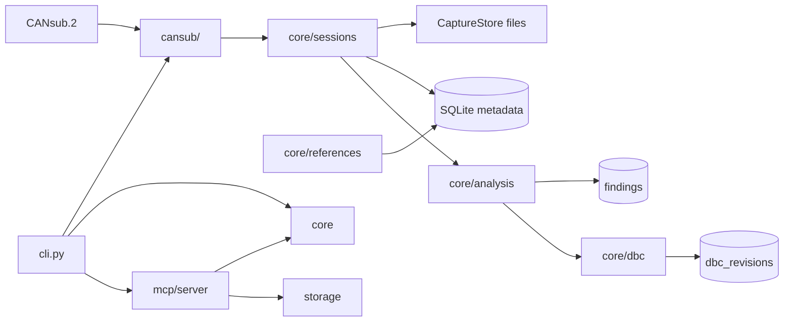

# can-research architecture

## Module boundaries

```text
canresearch/
├── cansub/     Hardware and CSS Electronics CANsub.2 API access only
├── core/       Protocol logic, references, DBC, sessions, analysis
├── mcp/        AI-facing tool interface (MCP server)
└── storage/    SQLite persistence for metadata and catalogues
```

### `cansub/` — hardware only

- USB and Ethernet discovery of CANsub.2 devices
- Connection management and live frame streaming
- No J1939 parsing, no DBC logic, no SQLite access
- Depends on CSS Electronics APIs/SDK (to be integrated when hardware is available)

### `core/` — domain logic

- **j1939** — 29-bit identifier parsing (no SAE reference data)
- **references** — local PGN/SPN catalogue populated from user imports
- **dbc** — DBC import/export and machine-specific generation
- **sessions** — session metadata; `CaptureStore` ABC for raw frames
- **analysis** — correlation and findings over sessions

Raw capture frames stay **outside** SQLite. Session rows hold metadata and a `frame_store_path` pointing to whatever format we choose (binary, Parquet, CSV, etc.) after measuring CANsub.2 logging volume.

### `mcp/` — AI client interface

- Exposes tools for session listing, reference lookup, analysis, and DBC operations
- Thin wrapper over `core/` and `storage/` — no direct hardware access
- Stdio transport in V1 (desktop MCP clients); SSE/HTTP reserved for later

### `storage/` — persistence

- SQLite for reference PGNs/SPNs, machines, sessions, observed PGNs, findings, DBC revisions
- Schema versioning via numbered migrations in `database.py`
- Default path: `data/canresearch.sqlite` (gitignored)

## External / licensed data

| Data | Location | In repo? |
|------|----------|----------|
| SAE J1939 PDF / database | User-owned, external | **No** |
| ISO 11783 / ISOBUS snapshots | User-owned, external | **No** |
| Imported DBC reference files | `references/private/` or user path | **No** |
| Parsed reference SQLite rows | `data/canresearch.sqlite` | **No** |
| Example fixtures | `examples/` | **Yes** (non-licensed samples only) |

Copyrighted standards content must not be parsed, stored, or reproduced in this repository without appropriate licence.

## Data flow (V1 target)



## Design decisions deferred

1. **Raw frame format** — await real CANsub.2 capture volume before choosing binary vs Parquet vs CSV
2. **CANsub.2 SDK** — exact Python/C API binding TBD when hardware is connected
3. **MCP transport** — stdio for V1; network transport when needed for remote clients
4. **Reference import sources** — DBC-first in V1; CSV/JSON import may follow
