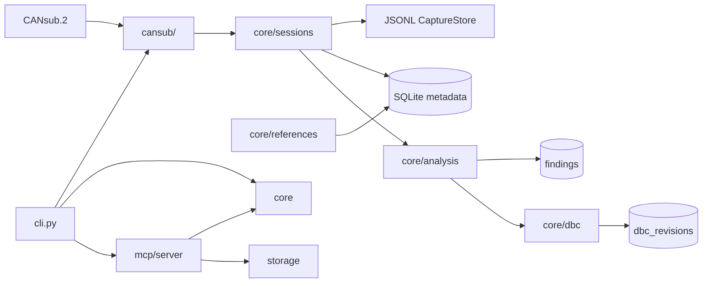

# can-research architecture

## Module boundaries

```text
canresearch/
├── cansub/     Hardware and CSS Electronics CANsub.2 API access only
├── core/       Protocol logic, references, DBC, sessions, analysis
├── mcp/        AI-facing tool interface (MCP server)
└── storage/    SQLite persistence for metadata and catalogues
```

### `cansub/` — hardware only

- Direct REST and WebSocket access to CANsub.2 (configured hostname or IP)
- Read-only channel status and live RX streaming
- Capture orchestration (`run_capture`) — no J1939 parsing, no DBC logic
- No SQLite access from this layer

### `core/` — domain logic

- **j1939** — 29-bit identifier parsing (no SAE reference data)
- **references** — local PGN/SPN/DDI catalogue populated from user imports
- **dbc** — DBC import/export and machine-specific generation
- **sessions** — session metadata; `JsonlCaptureStore` for raw frames
- **analysis** — correlation and findings over sessions

Raw capture frames stay **outside** SQLite. Session rows hold metadata and a
`frame_store_path` pointing to `data/sessions/<id>/frames.jsonl`.

### `mcp/` — AI client interface

- Exposes **read-only** tools for stored sessions, reference lookup, analysis, transport
  inspection, J1939 nodes/assets, research candidates, and in-memory DBC preview
- Exposes **signal research** tools: candidate ID ranking, byte/bit activity,
  repeated-action consistency, counter/checksum detection, reference correlation
- Thin adapter over `core/` and `cansub/` — delegates to existing service APIs
- **No CAN transmission** tools; **no automatic DBC mutation**; **no MCP confirmation**
- Stdio transport in V1 (desktop MCP clients); SSE/HTTP reserved for later

```text
AI agent
  ↓ MCP tool call
thin MCP handlers (handlers.py, live_handlers.py, signal_research_handlers.py)
  ↓
CAN Research core / cansub
  ├─ signal_research (candidates, repeat consistency, correlation)
  ├─ counter_detection / checksum_detection / candidate_fields
  ├─ live_research (observation, events, comparison)
  ├─ live_capture (background capture registry)
  ├─ sessions / analysis / decode
  ├─ J1939 TP / nodes / assets
  ├─ references
  └─ DBC preview (in-memory only)
  └─ research candidates (persisted review workflow; CLI confirm/reject)
  └─ research DBC generation (<asset>_research.dbc from confirmed candidates only)
```

Read-only MCP tools: `list_sessions`, `get_session`, `analyze_session`,
`decode_session`, `inspect_transport`, `list_session_nodes`, `list_assets`,
`get_asset`, `list_asset_nodes`, `lookup_pgn`, `lookup_spn`,
`build_session_dbc_preview`, `list_research_candidates`, `get_research_candidate`,
`list_candidate_evidence`, `preview_research_dbc`, `list_session_events`,
`preview_candidate_values`.

Live MCP tools (passive): `get_cansub_device_status`, `get_cansub_channel_status`,
`start_live_capture`, `stop_live_capture`, `observe_live_traffic`,
`mark_experiment_event`, `compare_experiment_windows`.

Signal research MCP tools (evidence only): `rank_signal_candidates`,
`analyze_can_id_activity`, `analyze_repeated_action`, `detect_counters`,
`detect_checksums`, `correlate_candidate_field`.

**Candidate ≠ confirmed.** On-demand signal research tools do not modify DBC files.
Persisted research candidates (schema v7) follow: `candidate → reviewed → confirmed`
(or `rejected`). Only confirmed candidates are eligible for `<asset_key>_research.dbc`.
MCP candidate tools are read-only; confirmation is CLI-only (human approval boundary).
Repeated-action consistency remains the strongest primitive for narrowing field candidates.

Concurrency: one active capture per channel.

### `storage/` — persistence

- SQLite for reference PGNs/SPNs, machines, sessions, observed PGNs, findings, DBC revisions
- **assets** — persistent device metadata (`asset_key`, type, manufacturer, model, …)
- **session_assets** — many-to-many link between sessions and assets with an explicit role
- **j1939_nodes** — global J1939 NAME identity (64-bit ECU/node identity)
- **j1939_node_observations** — session-specific source-address claims per node
- **research_candidates** / **research_candidate_evidence** / **research_candidate_status_history** — persisted review workflow (schema v7+); frame-identity index (v8)
- **asset_j1939_nodes** — persistent link between assets and J1939 NAME identities
- Schema versioning via numbered migrations in `database.py`
- Default path: `data/references/canresearch.db` (gitignored)

## External / licensed data

| Data | Location | In repo? |
|------|----------|----------|
| SAE J1939 PDF / database | User-owned, external | **No** |
| ISO 11783 / ISOBUS snapshots | User-owned, external | **No** |
| Imported DBC reference files | `references/private/` or user path | **No** |
| Parsed reference SQLite rows | `data/references/canresearch.db` | **No** |
| Capture frame JSONL | `data/sessions/` | **No** |
| Example fixtures | `examples/` | **Yes** (non-licensed samples only) |

Copyrighted standards content must not be parsed, stored, or reproduced in this repository without appropriate licence.

## Verified data flow (desk unit)

```text
CANsub.2 (USB hostname or Ethernet)
  -> REST control/status (device info, channel status)
  -> WebSocket RX (wss://.../api/can/{channel}/ws)
  -> JsonlCaptureStore (data/sessions/<id>/frames.jsonl)
  -> SQLite session metadata
  -> offline session analyze (core/analysis)
  -> observed_pgns aggregates + reference catalogue lookup
```

## Classification flow (implemented)

```text
saved session (frames.jsonl)
  -> J1939 identifier parser (core/j1939)
  -> PGN / source address / destination address
  -> aggregate by PGN + SA (+ DA for PDU1)
  -> local reference catalogue lookup
  -> classification: j1939_base_2001 / j1939_addition / isobus_addition / unknown
```

## SPN decode flow (implemented)

```text
saved session (frames.jsonl)
  -> known j1939_base_2001 / j1939_addition PGN only
  -> reference PGN-SPN mappings + SPN scaling metadata
  -> bit extraction (core/spn_bits) + scaling (core/spn_scaling)
  -> engineering values (on demand via session decode)
```

Unknown/proprietary PGNs and ISOBUS DDI interpretation are skipped for standard decode.
Transport-protocol reassembly and J1939 NAME identity mapping are implemented separately
(see below).

## Asset identity model (implemented)

A single capture session may contain traffic from multiple physical assets (tractor,
implement, controller/gateway, accessory). Assets are registered independently and
linked to sessions through `session_assets` with an explicit role.

```text
Asset registry (assets)
  ↔ J1939 NAME identity (j1939_nodes)           ← stable ECU/node identity
  ↔ session-specific source address (j1939_node_observations)
  → session association (session_assets: role = tractor | implement | controller | other)
  → observed traffic (frames.jsonl + session analyze)
  → asset-specific DBC generation (session dbc --asset <key>)
```

Core rules:

- **J1939 NAME** is the stable node identity (64-bit NAME from PGN 60928 Address Claim).
- **Source address** is session/network state, not identity. The same NAME may claim
  different SAs in different sessions.
- **One asset may contain multiple J1939 nodes** (engine, transmission, display, …).
- **One session may contain multiple assets** (tractor + implement on the same bus).
- **Asset-specific DBC** resolves traffic via linked J1939 NAMEs when `--source-address`
  is omitted; explicit `--source-address` overrides automatic resolution.

Tractor and implement DBCs remain separate files so they can be loaded together,
evolve independently, and carry clean provenance. The legacy `machines` table and
`sessions.machine_id` column remain for backward compatibility but are not the primary
multi-asset model.

## DBC generation flow (implemented)

```text
JSONL session
  -> asset must be linked to session
  -> source address selection:
       manual --source-address filter, OR
       automatic resolution from asset ↔ J1939 NAME links + session observations
  -> observed address-qualified J1939 traffic (PGN + SA + DA)
  -> reference-backed PGN/SPN mappings (j1939_base_2001 / j1939_addition only)
  -> mapping quality + overlap validation
  -> DBC model + provenance metadata (core/dbc_model)
  -> strict DBC writer with CM_ provenance comments (core/dbc_writer)
  -> <asset_key>_standard.dbc
```

If automatic resolution finds no linked nodes or no observed SAs for linked NAMEs in
the session, generation fails with a clear message (no silent “all session traffic”).

Generated DBCs include only reference-backed signals actually observed in the
selected traffic subset. Extended 29-bit CAN IDs use Vector-style `0x80000000` encoding in `BO_`
lines. Output follows [strict_dbc_compatibility_reference.md](strict_dbc_compatibility_reference.md).

Example (one session, two assets):

```text
Session abc123:
  jd_6155r_01      role tractor    NAME 0xAABB… → SA 0x00
  weedit_quadro_01 role implement  NAME 0x1122… → SA 0x80

Generated (automatic SA resolution):
  jd_6155r_01_standard.dbc
  weedit_quadro_01_standard.dbc
```

Proprietary/research DBC generation (implemented):

```text
Confirmed research candidates (asset-owned, multi-session)
  -> grouped by frame identity (is_extended, can_id)
  -> overlap validation vs other confirmed + reference-backed signals (best effort)
  -> classic 8-byte payload bounds enforced at create/confirm
  -> exclude counter/checksum/reserved unless --include-protocol-fields
  -> deterministic DBC model (core/research_dbc + core/dbc_writer)
  -> <asset_key>_research.dbc
```

Session provenance: `origin_session_id` on each candidate (nullable if session deleted).
Additional session links can be recorded via evidence rows. Confirmed signals belong to
the asset, not a single session.

## J1939 NAME / Address Claim (implemented)

```text
JSONL frames
  -> PGN 60928 (Address Claim) detection
  -> 8-byte NAME payload (LSB-first on bus)
  -> j1939_name parser (core/j1939_name)
  -> discover_j1939_nodes / scan_session_j1939_nodes
  -> persist j1939_nodes + j1939_node_observations (idempotent)
  -> optional asset_j1939_nodes link (asset node add)
  -> resolve_source_addresses_for_asset for DBC generation
```

Policies:

- NAME is the global identity key; source address is session-specific observation history.
- Repeated claims from the same NAME+SA increment `claim_count` and update timestamps.
- Same NAME claiming different SAs in one session preserves both observations; latest
  usable SA is available per node.
- Two different NAMEs claiming the same SA → `source_address_conflict` warning; identities
  are not merged.
- SA `0xFE` (Cannot Claim Address) is stored with `cannot_claim=1` and excluded from
  DBC SA resolution. SA `0xFF` is not a valid node source address.

`session analyze` adds an additive **J1939 identity** section (Address Claim frames,
unique NAMEs, claimed SAs, conflicts). `session nodes` lists persisted observations.

## Transport-protocol reassembly (implemented)

```text
JSONL frames
  -> J1939 parse
  -> single-frame traffic -------------------+
  -> TP.CM / TP.DT                           |
       -> BAM or RTS/CTS reassembly          |
       -> LogicalJ1939Message (is_transport)  |
                                             v
                              decode / analysis (on demand)
```

Supported modes: **BAM** (broadcast) and **RTS/CTS** (connection-managed).

Session key: `(mode, source_address, destination_address, transported_pgn)`.

Policies:
- Strict in-order TP.DT sequence validation (no reorder buffer in V1)
- Duplicate identical TP.DT ignored; conflicting duplicate invalidates transfer
- Stale transfers timeout after **1.25 s** of frame timestamp gap (J1939 TP default)
- End-of-session unfinished transfers → `incomplete_transport` warning
- RTS/CTS without EOM but all TP.DT packets present → completed with `missing_eom_ack`

Raw frame statistics in `session analyze` are unchanged. Transport metrics
(TP.CM/TP.DT counts, transfers started/completed/incomplete) are additive.

`session decode` skips TP.CM/TP.DT as application data and decodes completed
transport-reassembled payloads using reference mappings (including payloads
longer than 8 bytes where mappings exist).

**DBC limitation:** standard DBC export remains single-frame oriented. Multi-packet
transported payloads are not exported as `BO_` messages (`transported_pgn_not_dbc_exportable`).
Use `session tp` to inspect reassembled payloads.

## Planned next processing (not yet implemented)

```text
Live CANsub.2 MCP research controls (device status, capture start/stop, event markers)
```

## Full V1 target (includes future work)



## Design decisions

1. **Raw frame format** — JSON Lines for V1 (`JsonlCaptureStore`); Parquet deferred
2. **CANsub API** — stdlib HTTP + `websockets`; accepts any `MAJOR.MINOR` version from device
3. **MCP transport** — stdio for V1; network transport when needed for remote clients
4. **Reference import sources** — J1939/ISOBUS PDF importers implemented; DBC import scaffold remains
