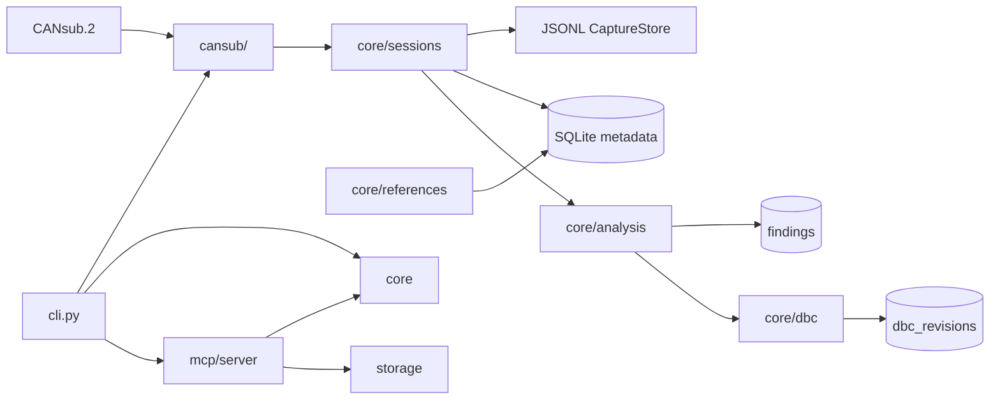

# can-research architecture

## Module boundaries

```text
canresearch/
├── cansub/     Hardware and CSS Electronics CANsub.2 API access only
├── core/       Protocol logic, references, DBC, sessions, analysis
├── mcp/        AI-facing tool interface (MCP server)
└── storage/    SQLite persistence for metadata and catalogues
```

### `cansub/` — hardware only

- Direct REST and WebSocket access to CANsub.2 (configured hostname or IP)
- Read-only channel status and live RX streaming
- Capture orchestration (`run_capture`) — no J1939 parsing, no DBC logic
- No SQLite access from this layer

### `core/` — domain logic

- **j1939** — 29-bit identifier parsing (no SAE reference data)
- **references** — local PGN/SPN/DDI catalogue populated from user imports
- **dbc** — DBC import/export and machine-specific generation
- **sessions** — session metadata; `JsonlCaptureStore` for raw frames
- **analysis** — correlation and findings over sessions

Raw capture frames stay **outside** SQLite. Session rows hold metadata and a
`frame_store_path` pointing to `data/sessions/<id>/frames.jsonl`.

### `mcp/` — AI client interface

- Exposes tools for session listing, reference lookup, analysis, and DBC operations
- Thin wrapper over `core/` and `storage/` — no direct hardware access
- Stdio transport in V1 (desktop MCP clients); SSE/HTTP reserved for later

### `storage/` — persistence

- SQLite for reference PGNs/SPNs, machines, sessions, observed PGNs, findings, DBC revisions
- Schema versioning via numbered migrations in `database.py`
- Default path: `data/references/canresearch.db` (gitignored)

## External / licensed data

| Data | Location | In repo? |
|------|----------|----------|
| SAE J1939 PDF / database | User-owned, external | **No** |
| ISO 11783 / ISOBUS snapshots | User-owned, external | **No** |
| Imported DBC reference files | `references/private/` or user path | **No** |
| Parsed reference SQLite rows | `data/references/canresearch.db` | **No** |
| Capture frame JSONL | `data/sessions/` | **No** |
| Example fixtures | `examples/` | **Yes** (non-licensed samples only) |

Copyrighted standards content must not be parsed, stored, or reproduced in this repository without appropriate licence.

## Verified data flow (desk unit)

```text
CANsub.2 (USB hostname or Ethernet)
  -> REST control/status (device info, channel status)
  -> WebSocket RX (wss://.../api/can/{channel}/ws)
  -> JsonlCaptureStore (data/sessions/<id>/frames.jsonl)
  -> SQLite session metadata
  -> offline session analyze (core/analysis)
  -> observed_pgns aggregates + reference catalogue lookup
```

## Classification flow (implemented)

```text
saved session (frames.jsonl)
  -> J1939 identifier parser (core/j1939)
  -> PGN / source address / destination address
  -> aggregate by PGN + SA (+ DA for PDU1)
  -> local reference catalogue lookup
  -> classification: j1939_base_2001 / j1939_addition / isobus_addition / unknown
```

## Planned next processing (not yet implemented)

```text
classified session
  -> SPN value decode (scaling, offsets)
  -> base machine DBC generation (strict DBC compatibility reference)
```

Future generated DBCs must follow [strict_dbc_compatibility_reference.md](strict_dbc_compatibility_reference.md)
for CSS webCAN-compatible conservative output.

## Full V1 target (includes future work)



## Design decisions

1. **Raw frame format** — JSON Lines for V1 (`JsonlCaptureStore`); Parquet deferred
2. **CANsub API** — stdlib HTTP + `websockets`; accepts any `MAJOR.MINOR` version from device
3. **MCP transport** — stdio for V1; network transport when needed for remote clients
4. **Reference import sources** — J1939/ISOBUS PDF importers implemented; DBC import scaffold remains
